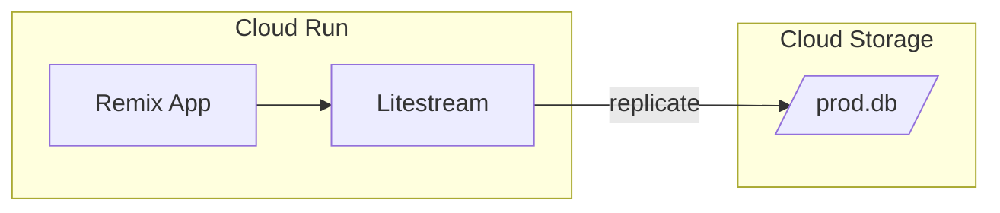

# データベースのバックアップと永続化

このプロジェクトでは、SQLiteデータベースのバックアップと永続化にLitestreamを使用しています。

## アーキテクチャ概要



## 動作の仕組み

1. **データベースの復元**

   - コンテナ起動時、Google Cloud Storageから最新のバックアップを復元
   - 初回起動時やバックアップが存在しない場合は、空のデータベースを使用

2. **リアルタイムレプリケーション**
   - アプリケーション実行中、データベースの変更をCloud Storageに自動的にレプリケート
   - WALモードの無効化によりPrismaとの互換性を確保

## 制限事項

1. **インスタンス数の制限**

   - Cloud Runのインスタンス数は最大1に制限
   - 複数インスタンスでの同時実行はデータ整合性の問題を引き起こす可能性あり

2. **Prismaとの互換性**
   - PrismaはSQLiteのWALモードに非対応
   - 起動時に`PRAGMA journal_mode=DELETE`を実行して対応

## 開発環境との違い

開発環境では通常のSQLiteデータベースとして動作し、Litestreamは使用しません。本番環境（Cloud Run）でのみLitestreamによるバックアップと永続化が有効になります。

## デプロイ時の設定

1. **必要な環境変数**

   ```
   LITESTREAM_BUCKET=<バックアップ先のバケット名>
   ```

2. **必要な権限**
   - Cloud Run サービスアカウントに以下の権限が必要：
     - `roles/storage.objectViewer`
     - `roles/storage.objectCreator`

## トラブルシューティング

1. **データベースロックエラー**

   ```
   Error: SQLite database error
   database is locked
   ```

   対処法：

   - アプリケーションの再起動
   - WALモードが正しく無効化されているか確認

2. **バックアップの確認**
   ```sh
   # バックアップの存在確認
   gcloud storage ls gs://<BUCKET_NAME>/prod.db/
   ```

## 参考リンク

- [Litestream Documentation](https://litestream.io/)
- [Prisma with SQLite](https://www.prisma.io/docs/orm/overview/databases/sqlite)
